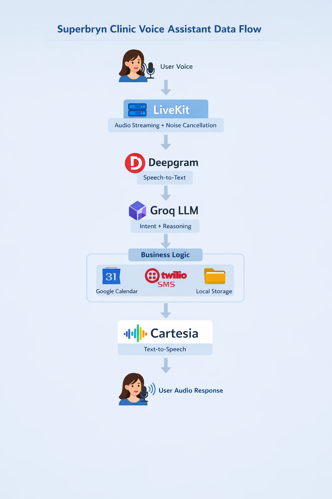

[Live Demo](assignment121.up.railway.app)

# Superbryn Clinic Voice Assistant

A real-time voice assistant for clinic appointment management, built with LiveKit, Groq LLM, Cartesia TTS, and integrated with Google Calendar and Twilio SMS.

## Features

- **Voice Interaction**: Handles booking, canceling, and rescheduling appointments via natural speech.
- **AI-Powered**: Uses Groq's fast LLM for intelligent conversation flow.
- **Text-to-Speech**: Cartesia provides low-latency, high-quality voice synthesis.
- **Speech-to-Text**: Deepgram ensures accurate transcription.
- **Calendar Integration**: Syncs with Google Calendar for availability and bookings.
- **SMS Notifications**: Sends confirmation messages via Twilio.
- **Avatar Support**: Optional Beyond Presence avatar for visual interaction.
- **Noise Cancellation**: Improves audio quality with LiveKit's noise suppression.
- **Dockerized**: Easy deployment with containerization.

## Prerequisites

- Python 3.11+
- Docker (for containerized deployment)
- API Keys for:
  - LiveKit
  - Groq
  - Cartesia
  - Deepgram
  - Google Calendar (Service Account JSON)
  - Twilio
  - Beyond Presence (optional)

## Architecture

The Superbryn Clinic Voice Assistant is built as a real-time, event-driven voice pipeline that connects live audio streaming, AI reasoning, and external service integrations.

### High-Level Flow

1. **Client / Browser**
   - User speaks through a web or desktop client connected to LiveKit.
   - Audio streams are sent in real time to the LiveKit room.

2. **LiveKit Media Server**
   - Manages real-time audio streaming, noise cancellation, and session orchestration.
   - Routes audio data between the client and the voice assistant service.

3. **Speech-to-Text (Deepgram)**
   - Incoming audio is transcribed into text with low latency and high accuracy.
   - Transcriptions are streamed back to the assistant for intent understanding.

4. **LLM Orchestration (Groq)**
   - The transcribed text is sent to Groq’s LLM.
   - The model interprets user intent, manages dialogue flow, and decides which tools to invoke (calendar, SMS, etc.).

5. **Business Logic Layer**
   - Appointment workflows are handled in the assistant layer.
   - Tool calls integrate with:
     - **Google Calendar** for availability checks, booking, cancellation, and rescheduling.
     - **Twilio SMS** for sending confirmations and reminders.
     - **Local JSON Storage (Fallback)** for persistence when external services are unavailable.

6. **Text-to-Speech (Cartesia)**
   - The LLM’s response is converted into natural-sounding speech.
   - Audio is streamed back to the user through LiveKit.

7. **Optional Avatar (Beyond Presence)**
   - Provides a visual avatar synchronized with voice output for enhanced user interaction.

8. **Containerized Deployment**
   - All services are packaged using Docker for consistent deployment and portability.

### Data Flow Summary



## Installation

1. Clone the repository:
   ```bash
   git clone https://github.com/yugborana/Superbryn_Assignment.git
   cd Superbryn_Assignment

2. Install Dependencies:
    pip install -r requirements.txt

3. Set up environment variables:
    - Make a .env file and fill in your API keys.
    - Place your_service_account.json in the root directory for Google Calendar access.

    - .env structure:    
        LIVEKIT_URL=
        LIVEKIT_API_KEY=
        LIVEKIT_API_SECRET=

        CARTESIA_API_KEY = 
        DEEPGRAM_API_KEY = 
        GROQ_API_KEY = 

        BEYOND_PRESENCE_API_KEY =
        BEYOND_PRESENCE_AVATAR_ID =

        GOOGLE_CALENDAR_CLIENT_ID = 
        GOOGLE_CALENDAR_CLIENT_SECRET = 

        TWILIO_ACCOUNT_SID = 
        TWILIO_AUTH_TOKEN = 
        TWILIO_PHONE_NUMBER = 

## LLM Selection Rationale

Groq was selected as the primary Large Language Model (LLM) provider for this pipeline due to its performance, latency characteristics, and suitability for real-time voice applications.

### Low Latency for Real-Time Interaction
Voice-based systems require extremely fast response times to maintain natural conversation flow. Groq’s inference infrastructure is optimized for ultra-low latency token generation, which significantly reduces end-to-end response time and improves conversational responsiveness.

### High Throughput and Consistent Performance
The system must handle continuous streaming requests, interruptions, and rapid turn-taking. Groq provides stable throughput under load, ensuring predictable performance even during concurrent sessions.

### Streaming-Friendly Architecture
Groq supports efficient streaming responses, allowing partial outputs to be processed immediately. This enables early text-to-speech synthesis and minimizes perceived response delays.

### Cost Efficiency at Scale
Compared to traditional GPU-based inference, Groq’s architecture offers competitive cost efficiency for sustained real-time workloads, making it suitable for production deployment and scaling.

### Reliability for Agent-Oriented Workflows
The assistant relies on structured reasoning, tool invocation, and deterministic behavior. Groq delivers consistent outputs and stable API performance, which is critical for production-grade agent pipelines.

### Seamless Integration
Groq provides simple API integration with existing Python async workflows, allowing clean orchestration with LiveKit, speech services, and backend tools without complex infrastructure overhead.

## Usage
### Local Development
    1. Run the agent:
        python main.py dev
        
    2. The agent connects to your LiveKit room and starts listening to commands.

### Docker Deployment
    1. Build the image:
        docker build -t superbryn-assistant .
    
    2. Run the container:
        docker run -e LIVEKIT_URL=your_url -e LIVEKIT_API_KEY=your_key -e LIVEKIT_API_SECRET=your_secret superbryn-assistant

## Configuration

### Environment Variables
    - All API keys are loaded from `.env` or system environment.

### Calendar Settings
    - Update `CALENDAR_ID` in `gcal_manager.py` for your Google Calendar.

### Service Durations
    - Modify the `SERVICES` dict in `gcal_manager.py` for custom appointment lengths.

### Prompts
    - Customize agent behavior in `prompts.py`.

---

# Project Structure

- **main.py** – Entry point and LiveKit session management.  
- **assistant.py** – Core agent logic with tools for appointment management.  
- **gcal_manager.py** – Google Calendar integration.  
- **sms_manager.py** – Twilio SMS handling.  
- **prompts.py** – System instructions for the LLM.  
- **dependencies.py** – Service initialization and logging.  
- **db_manager.py** – Local JSON-based appointment storage (fallback).  
- **agent.py** – Alternative agent implementation (similar to assistant.py).  
- **Dockerfile** – Containerization setup.  
- **requirements.txt** – Python dependencies.  

---

# Contributing

1. Fork the repository.  
2. Create a feature branch.  
3. Commit changes.  
4. Push and create a pull request.  

---

# License

This project is licensed under the MIT License. See LICENSE for details.


    
